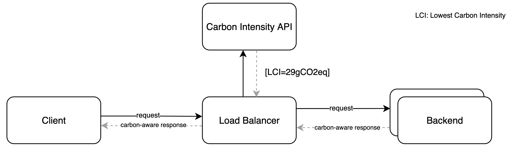

# Carlo
An experimentally naive carbon-aware Load Balancer

### Introduction

Carbon awareness is an emergent concept gaining traction in the tech community. It is one
of those concepts that sits at the convergence of Sustainability and Information Technology. This convergence
is being referred to as Green Tech or Sustainable Tech, and it raises the question on how technology can develop
a more sustainable approach to fulfilling business needs.

#### Load Balancing

A load balancer is a layer of software + hardware that sits in front of a pool of servers.
Its main use case is to efficiently distribute incoming client requests to available backend servers.
In order to do so, it executes different types of algorithms to determine which server should serve which request.

### Architecture

Carlo builds on this idea by defining a very simple substitute algorithm. Instead of calculating server availability,
the idea is to rely on an external service to determine the carbon intensity of the region in which a server is running.

This way, the load balancer can select the server with the lowest carbon intensity i.e. the greenest electricity currently
being used to power up those servers.

**Note:** Servers in different regions are being represented by local sub-processes serving requests on specific ports. This design 
decision contributes towards simplicity when deploying multiple backends, thus allowing for a rapid visualization of traffic
load balancing in a local environment.

For more information about the theory, design, trade-offs and assumptions made for this work, please take a look at the [article](https://medium.com/@drfratte/carlo-carbon-aware-load-balancing-f02982999b75)
in which this gets further explained.

### How to run it?

**Disclaimer:** for the context of GSF Hack '22 there are two different versions for this application in different branches
* **main**: contains the version in which randomly generated carbon intensity values are assigned to different regions
* **api-integration**: contains the version in which the Carbon Aware API is integrated and consumed by the algorithm

Open up a terminal and go to the main directory of the application to run:

<code>go run .</code>

You should see the message that carlo is listening on port 8000

<code>carlo load balancer listening at 'localhost:8000'</code>

Open up another terminal tab, and hit the URL with curl:

<code>curl http://localhost:8000</code>

You should see some information being logged into the first terminal (intermediate steps of the algorithm while choosing
the best alternative), and in the client terminal you'll se the carbon-aware response from the optimally
selected server:

<code>Hello from [::]:3333! This is a carbon-aware server response</code>

### Contribute

Contributions are welcome in the form of feedback, opening GitHub issues, or submitting pull requests.

### Author

Crafted with 💚 by [Daniel Fratte](https://www.linkedin.com/in/drfratte/)
